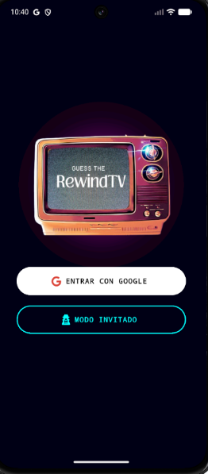
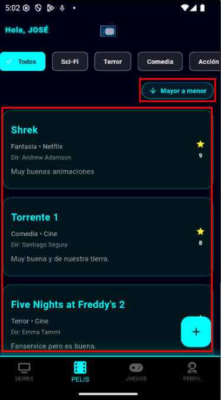
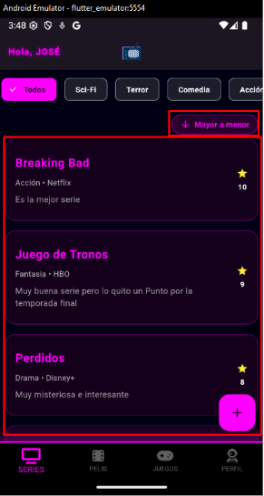
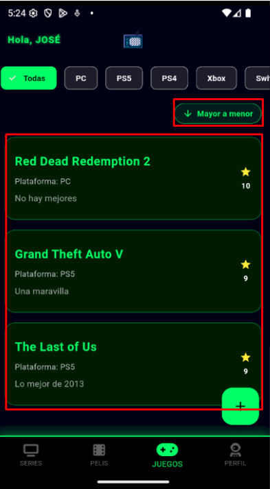

# RewindTV

**RewindTV** es una aplicación moderna desarrollada con **Flutter** diseñada para gestionar tu biblioteca personal de series, películas y videojuegos. La aplicación destaca por su estética visual oscura con acentos neón y una integración completa con **Firebase** para la persistencia de datos y la autenticación.

## 📸 Capturas de Pantalla

| Inicio | Películas | Series | Juegos |
| :---: | :---: | :---: | :---: |
|  |  |  |  |

## ✨ Características Principales

* **Gestión Multi-Contenido**: Secciones dedicadas para Series, Películas y Videojuegos, cada una con su propia paleta de colores neón representativa.
* **Autenticación Flexible**: Permite el acceso mediante **Google Sign In** o a través de un **Modo Invitado** para navegación rápida.
* **CRUD en Tiempo Real**: Capacidad para añadir, editar y eliminar registros con actualización instantánea gracias a la integración con **Cloud Firestore**.
* **Filtros y Ordenación**:
    * Filtrado por género en series y películas (Sci-Fi, Terror, Comedia, Acción, etc.).
    * Filtrado por plataforma en videojuegos (PC, PS5, Xbox, Switch, etc.).
    * Ordenación de mayor a menor puntuación (y viceversa).
* **Diseño Moderno**: Interfaz basada en **Material 3** con un tema oscuro personalizado (`0xFF0D0213`) y efectos de sombras neón magenta y cian.

## 🛠️ Tecnologías Utilizadas

* **Framework**: [Flutter](https://flutter.dev) (SDK ^3.10.7).
* **Base de Datos**: [Cloud Firestore](https://firebase.google.com/docs/firestore) para almacenamiento en la nube.
* **Autenticación**: [Firebase Auth](https://firebase.google.com/docs/auth) y [Google Sign In](https://pub.dev/packages/google_sign_in).
* **Iconografía**: [Font Awesome Flutter](https://pub.dev/packages/font_awesome_flutter).

## 🚀 Configuración del Proyecto

### Requisitos Previos

* Flutter SDK instalado.
* Un proyecto creado en la [Consola de Firebase](https://console.firebase.google.com/).

### Instalación

1.  **Clonar el repositorio**:
    ```bash
    git clone [https://github.com/josemajr6/rewind-tv.git](https://github.com/josemajr6/rewind-tv.git)
    cd rewind-tv
    ```

2.  **Instalar dependencias**:
    ```bash
    flutter pub get
    ```

3.  **Configurar Firebase**:
    * Descarga el archivo `google-services.json` (Android) y colócalo en `android/app/src/`.
    * Descarga `GoogleService-Info.plist` (iOS) y añádelo a través de Xcode.

4.  **Ejecutar la aplicación**:
    ```bash
    flutter run
    ```

## 📂 Estructura del Proyecto (`lib/`)

* `main.dart`: Punto de entrada y configuración del tema global.
* `screens/`: Pantallas principales de la interfaz (Auth, Home, Series, Movies, Games).
* `services/`: Lógica de autenticación y conexión con Firestore.
* `models/`: Definición de las clases de datos (Serie, Movie, Game).

---
Desarrollado como un proyecto personal de gestión multimedia.